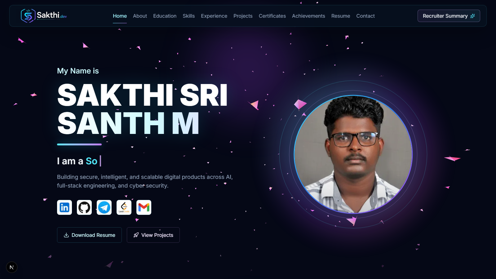

# Sakthi.dev — Developer Portfolio

<p align="center">
  <strong>A premium developer portfolio presenting software engineering, cyber security, AI, full-stack development, internships, projects, certifications, and achievements.</strong>
</p>

<p align="center">
  <a href="https://nextjs.org/"></a>
  <a href="https://www.typescriptlang.org/"></a>
  <a href="https://tailwindcss.com/"></a>
  <a href="https://www.framer.com/motion/"></a>
</p>



## Overview

Sakthi.dev is the personal portfolio of **Sakthi Sri Santh M**, a Computer Science and Engineering student specializing in Cyber Security. It is designed as a concise, evidence-driven profile where recruiters and engineering teams can review technical work, academic growth, internships, verified credentials, and contact information in one responsive experience.

The portfolio combines a dark futuristic visual system with accessible navigation, optimized animation, interactive document viewers, project case studies, and a dedicated recruiter summary.

## Highlights

- Responsive desktop, tablet, and mobile experience
- Optimized Vanta.js bird animation with reduced WebGL load
- Professional candidate snapshot for rapid recruiter review
- Seven product-focused software projects with live and source links
- Three documented internship experiences
- Seventy-two verified certifications grouped by knowledge domain
- Academic timeline and interactive coursework explanations
- Certificate, internship, and achievement PDF previews
- Filterable project and certification sections
- Gmail-powered contact workflow and direct social links
- Smooth Framer Motion transitions with reduced-motion support
- SEO metadata and optimized Next.js image rendering

## Portfolio Sections

| Section | Purpose |
| --- | --- |
| Home | Professional identity, animated roles, profile photo, social links, and primary actions |
| Professional Summary | Engineering strengths, product portfolio, and career journey |
| About | Degree, specialization, focus areas, and personal engineering direction |
| Education | Animated academic timeline, scores, institutions, and locations |
| Coursework | Interactive knowledge areas with concise learning outcomes |
| Skills | Technology stack organized by engineering category |
| Experience | Internship records, contributions, growth, and verified certificates |
| Projects | Product cards, live demos, repositories, and concise case studies |
| Certifications | Domain explorer with real PDF previews and learning outcomes |
| Achievements | Hackathons, technical competitions, impact, and proof documents |
| Resume | Resume preview and document actions |
| Contact | Direct contact information and a prefilled Gmail message workflow |

## Featured Projects

| Project | Focus | Links |
| --- | --- | --- |
| AnimeZ | Responsive anime discovery and media interface | [Live](https://animez-plum.vercel.app) · [GitHub](https://github.com/sakthisrisanth98/AnimeZ) |
| AstroVelo | Phaser-based space survival game | [Live](https://astrovelo-space-survival-game.vercel.app) · [GitHub](https://github.com/sakthisrisanth98/astrovelo-space-survival-game) |
| Limitra AI | Full-stack AI assistant workspace | [Live](https://limitra-ai.vercel.app) · [GitHub](https://github.com/sakthisrisanth98/Limitra-AI) |
| Nexmart | Multi-vendor commerce platform | [Live](https://nexmart-ebon.vercel.app) · [GitHub](https://github.com/sakthisrisanth98/Nexmart) |
| Cropix AI Studio | Image processing, restoration, and export workspace | [Live](https://cropix-ai.vercel.app) · [GitHub](https://github.com/sakthisrisanth98/Cropix-AI) |
| AegisMTD | Moving Target Defense and cyber deception platform | [GitHub](https://github.com/sakthisrisanth98/Aegistmd) |
| WebGuard | Browser privacy intelligence extension | [GitHub](https://github.com/sakthisrisanth98/WebGuard---Extension) |

## Technology Stack

### Application

- Next.js 15 and React 19
- TypeScript 5
- Tailwind CSS 4
- Radix UI Dialog
- Lucide React icons

### Motion and Visuals

- Framer Motion
- GSAP
- Three.js
- Vanta.js Birds, Net, and Halo effects

### Quality

- ESLint
- TypeScript strict validation
- Playwright visual and responsive checks
- Next.js Image optimization

## Project Structure

```text
Portfolio/
├── public/
│   ├── Projects/                 # Project screenshots
│   ├── certificates/             # Verified certificate PDFs
│   ├── certificate-previews/     # Optimized certificate previews
│   ├── intern/                   # Internship records
│   ├── intern-previews/          # Internship preview images
│   ├── achievement-previews/     # Achievement proof previews
│   └── vendor/vanta/             # Local Vanta effect scripts
├── scripts/
│   └── clean-next.mjs            # Next.js cache cleanup helper
├── src/
│   ├── app/
│   │   ├── globals.css           # Portfolio design system
│   │   ├── layout.tsx            # Metadata and application shell
│   │   └── page.tsx              # Portfolio sections and interactions
│   └── types/
│       └── vanta.d.ts            # Vanta.js declarations
├── package.json
└── tsconfig.json
```

## Getting Started

### Prerequisites

- Node.js 20 or newer
- npm 10 or newer

### Installation

```bash
git clone https://github.com/sakthisrisanth98/Portfolio.git
cd Portfolio
npm install
```

### Development

```bash
npm run dev
```

Open [http://localhost:3000](http://localhost:3000).

### Production Build

```bash
npm run build
npm start
```

## Available Scripts

| Command | Description |
| --- | --- |
| `npm run dev` | Starts the Next.js development server |
| `npm run build` | Creates an optimized production build |
| `npm run start` | Runs the production server |
| `npm run lint` | Runs ESLint |
| `npm run clean` | Removes generated Next.js cache files |

## Performance and Accessibility

- Vanta Birds uses a reduced simulation count and capped canvas pixel density.
- Animated effects are restricted to their intended viewport areas.
- Reduced-motion preferences are respected.
- Interactive controls include labels, focus states, and keyboard-accessible dialogs.
- Responsive layouts are verified at desktop and mobile viewport sizes.

## Contact

- **Email:** [sakthisrisanth98@gmail.com](https://mail.google.com/mail/?view=cm&fs=1&to=sakthisrisanth98%40gmail.com)
- **LinkedIn:** [sakthi-sri-santh-m-416540290](https://linkedin.com/in/sakthi-sri-santh-m-416540290)
- **GitHub:** [sakthisrisanth98](https://github.com/sakthisrisanth98)
- **LeetCode:** [sakthisrisanth98](https://leetcode.com/u/sakthisrisanth98)
- **Telegram:** [sakthisrisanth](https://t.me/sakthisrisanth)

## Repository

[github.com/sakthisrisanth98/Portfolio](https://github.com/sakthisrisanth98/Portfolio)

---

<p align="center">Designed and developed by Sakthi Sri Santh M.</p>
